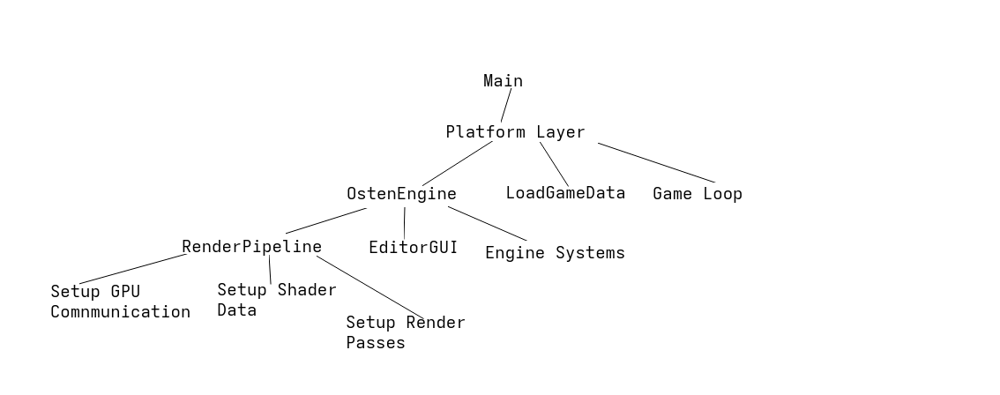

# OstenEngine

OstenEngine Is a hobby work in progress Vulkan game engine written in C/C++ with the goal of learning as much as possible during the process of making it.
A secondary goal during this project was to use minimal amount of dependencies, I would say I kind of have to many and that might be reduced as I continue working on it.
The current dependencies are GLFW, ImGui, stb_image.h, math_3d.h and of course Vulkan I have some rough ideas that I want to move away from GLFW and ImGui to either make my own version or find a 
single header version to simplify compilation of the project.

## How To Build

### Windows

#### Prerequisites

You will have to have Cmake installed on your windows system to be able to compile OstenEngine to see if you have it installed you can open your terminal
and write 

    cmake --version
    
    //If you get something like this you have Cmake
    cmake version 4.3.1

to see if you have Cmake installed. If you find that you do not have Cmake you can follow the instructions on the [Cmake Website](https://cmake.org/).

Next step is to make sure you have Vulkan installed on your system and to do that you can try running this command 

    vkcube

And if you get a spinning cube rendering you have Vulkan installed otherwise you will need to install it and to do that follow the instructions on [LunarG Website](https://vulkan.lunarg.com/).

Final step before compiling is to make sure you have a compiler installed the ones that I have tested to work is Clang, G++ and MSVC.
If you don't have one of these installed I would recommend Clang or MSVC on Windows since G++ is tougher for beginners to setup.
Installing Visual Studio will include both clang and MSVC and you can find Visual Studio on [Microsoft Website](https://visualstudio.microsoft.com/).

To see if you already have one of those 2 installed you can open the terminal and write

    clang --version
    
    //OR
    
    msvc --version

If it gives you a version number on either of them then you should be fine to actually compile the project.

Then to compile the project you should just need to run this command in the terminal when located inside the Engine folder.

    cmake --build .

### Linux

#### Prerequisites

So compiling this project should be relatively simple as far as I am aware there is only  2 dependencies that you will need to be able to compile this project, the compiler and vulkan.

Installing a C++ compiler on your system depends on your system, here are some of the more popular distros:

Debian Based

    sudo apt install g++
    
Fedora Based

    sudo dnf install gcc-c++
    
Arch Based

    sudo pacman -S gcc
    
Then next you will need to install the vulkan developer kit for your distro, popular examples:

Debian Based

    sudo apt install libvulkan-dev
    
Fedora Based

    sudo dnf install vulkan-loader-devel
    
Arch Based

    sudo pacman -S vulkan-devel
    
And with that I believe that that is all the dependence to compile this project I have not tested on all those platforms so might add more steps when I get around to trying it on them.
Then finally we can build this project, and you should be able to run one of these following commands:

    //Helper Script
    bash linux_builder.sh

    //Manual G++
    g++ -o OstenEngine main.cpp -O0 -Wall -Iexternal/vk_include/  -Iexternal/glfw/include/ -Lexternal/built_glfw/ -Lexternal/ -lglfw3  -limgui  -lX11 -lvulkan -g
    
    //Or with clang
    clang++ -o OstenEngine main.cpp -O0 -Wall -Iexternal/vk_include/  -Iexternal/glfw/include/ -Lexternal/built_glfw/ -Lexternal/ -lglfw3  -limgui  -lX11 -lvulkan -g

If you have issues with a compile error like GLFW or ImGui missing you might need to recompile them for your system.
They can be found in the external folder and there is a helper .sh script in there that should compile them into a lib.a that the project uses.

### Additional Info

The engine at the moment does not support figuring out file paths automatically and instead you will need to either run it in the engine folder or move required items to the same folder as the executable

OstenEngine requires that the shaders are placed in this filepath in relation to where the engine is running.

    src/renderer/shaders/

### Engine Execution Summary

The data loaded by the engine is inside a text file in "game/game_data.txt"

That text file could contain something like this:

    !1
    #Model_Paths
    assets/debug_assets/Cube.obj
    assets/debug_assets/viking.bin
    #Texture_Paths
    assets/debug_assets/debug_texture.png
    assets/debug_assets/funny_texture.jpg
    #Render_Instances //Corresponds to model_index/texture_index
    0/1/4000
    1/2/4000
    

The parser looks at ! to find parsing version 1 is the first and only one that exists so far.

Then the parser will look at # to load data the text after the # does not mean anything it is just to make it easier to understand for humans.
The first # is model paths the asset loader will look in the 2nd # tells the asset loader to load those textures then the final # means that the render pipeline should prepare 
render instances using the first number as a model index the second as a texture index and third is the capacity of this renderable model.

#### Quick Start Game Code:

    //Change this line in your platformlayer to your C or Cpp file containing what you want to run
    #include "game/total_cheese.hpp"

    struct GameData{
      //Put whatever data you want to store in the game
      bool* paused_state;
      void (*game_code)(OstenEngine*, GameData*) = nullptr;
    };
    
    static void run_game(OstenEngine* engine, GameData* data){
      //Game Code
    }
    
    static void menu_state(OstenEngine* engine, GameData* data){
      //Some menu code
      
      if(example_button){
        data->game_code = run_game;
      }
    }
    
    //Function called by platform layer
    static void load_game_resources(OstenEngine* engine, GameData* data){
    
      struct InstanceData render_ids = {};
    
      render_ids.model_index = loaded_models.size()-1;
      render_ids.texture_index = 1;
      render_ids.capacity = 2;
      
      //Tells engine to create a model with texture 1 and a capacity of 2
      add_message_f(MessageType::CreateRenderable, sizeof(InstanceData), (char*)&render_ids);
    
      data->game_code = menu_state;
    }

Right now the OstenEngine API is very and I mean very bare-bones but some actions included are creating entities creating model instances with a material and loading of textures/models

The image formats supported by load texture is png and jpeg at the moment

Example Usage:

    char* message = "cube.bin";
    uint8_t message_size = sizeof(message);
    add_message_f(MessageType::LoadModel, message_size, message);
